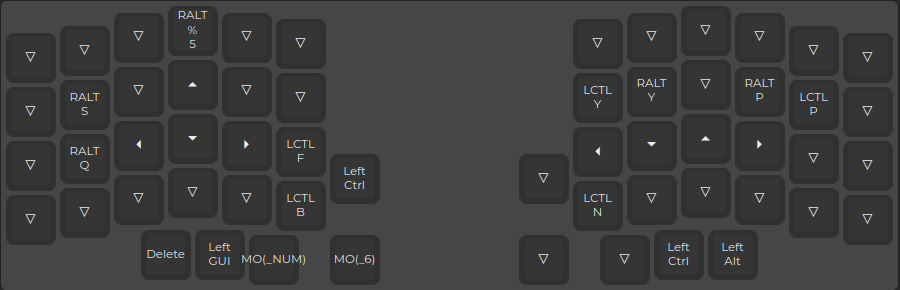

# QMK config for Lily58
My keymap is based on the [default layout](https://github.com/qmk/qmk_firmware/tree/master/keyboards/splitkb/aurora/lily58) by [splitkb](https://splitkb.com/).

## Features
- 4 Layers with an option to upgrade to 6 layers.
- RALT umlaut emulation on Layer 2 for ä,ü,ö,ß,€.
- Numpad for left hand on Layer 3.
- Support for 2 SSD1306 displays in long format
- 2 encoders used for:
    - Layer 0: Mouse wheel and Volume
    - Layer 1: Mouse emulation (up/down, left/right)
    - Layer 2: Page up/down
    - Layer 3: RGB lighting (hue, saturation)
    - Layer 4: Mouse wheel and Volume

## Layers

### BASE


### Function 1: Special Characters


### Function 2: Navigation, German characters


### NUM: RGB, NUMpad


### Gaming: WASD shifted once to the right side


## Build
Setup qmk, then compile and flash using:
```bash
make flash
```

Once the compilation is finished and qmk is waiting
for the drive of the microcontroller to flash the firmware to,
execute following command which will mount `/dev/sdd1` and allows
qmk to flash it.
```bash
sleep 8 && make mount
```
> [!NOTE]
> The sleep gives you time to quickly double tap the reset button on your
> controller, allowing you to flash the keyboard without having to
> fall back to another keyboard to execute the mount command.
